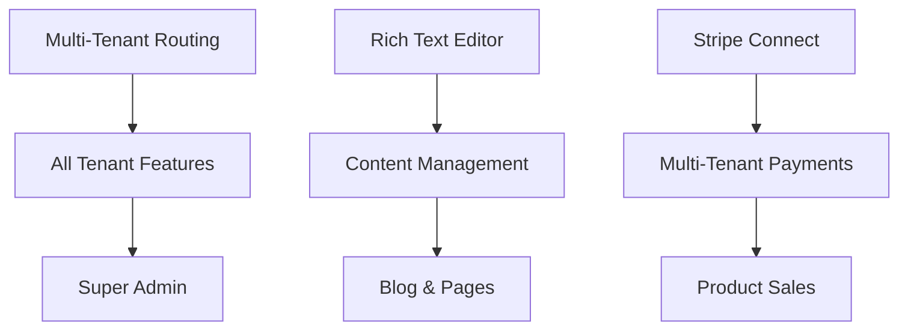

# Implementation Roadmap - Priority Order

## Quick Reference

**Current Status:** 65% Complete
**Target:** 100% Complete
**Timeline:** 8-12 weeks
**Critical Path Items:** 3 (Multi-tenant, Editor, Stripe Connect)

---

## Week 1: Multi-Tenant Foundation

### Day 1-2: Subdomain Routing
```bash
# Priority: P0 - BLOCKING ALL TENANT FEATURES
```

**Implementation Steps:**
1. Update `middleware.ts`:
   ```typescript
   // Extract subdomain from hostname
   const hostname = request.headers.get('host')
   const subdomain = hostname?.split('.')[0]
   
   // Resolve tenant from subdomain or custom domain
   const tenant = await resolveTenant(subdomain, hostname)
   
   // Inject tenant into request headers
   request.headers.set('x-tenant-id', tenant.id)
   ```

2. Create `src/contexts/TenantContext.tsx`:
   ```typescript
   export const TenantProvider = ({ children }) => {
     const [tenant, setTenant] = useState(null)
     // Fetch tenant based on subdomain
     return <TenantContext.Provider value={tenant}>
   }
   ```

3. Database migration:
   ```sql
   ALTER TABLE tenants ADD COLUMN subdomain TEXT UNIQUE;
   UPDATE tenants SET subdomain = slug;
   ```

4. Environment setup:
   ```bash
   NEXT_PUBLIC_ROOT_DOMAIN=platform.com
   ```

**Testing:**
- Test with /etc/hosts: `127.0.0.1 tenant1.platform.local`
- Verify tenant isolation
- Test custom domain routing

---

### Day 3-5: Rich Text Editor

```bash
# Priority: P0 - BLOCKING CONTENT MANAGEMENT
```

**Implementation Steps:**
1. Install TipTap:
   ```bash
   npm install @tiptap/react @tiptap/starter-kit @tiptap/extension-image @tiptap/extension-link
   ```

2. Create `src/components/editor/RichTextEditor.tsx`:
   ```typescript
   import { useEditor, EditorContent } from '@tiptap/react'
   import StarterKit from '@tiptap/starter-kit'
   
   export function RichTextEditor({ content, onChange }) {
     const editor = useEditor({
       extensions: [StarterKit],
       content,
       onUpdate: ({ editor }) => onChange(editor.getHTML())
     })
     
     return (
       <>
         <Toolbar editor={editor} />
         <EditorContent editor={editor} />
       </>
     )
   }
   ```

3. Create toolbar with:
   - Bold, Italic, Underline
   - Headings (H1-H6)
   - Lists (bullet, numbered)
   - Links
   - Images
   - Code blocks

4. Integrate into:
   - `/admin/blog` - Blog post editor
   - `/admin/content` - Page editor

**Testing:**
- Test all formatting options
- Test image upload
- Test content saving
- Test content rendering

---

## Week 2: Stripe Connect

### Day 1-5: Payment Infrastructure

```bash
# Priority: P0 - BLOCKING MULTI-TENANT PAYMENTS
```

**Implementation Steps:**
1. Stripe Connect setup:
   - Create Connect platform in Stripe Dashboard
   - Configure OAuth redirect URLs
   - Get Connect credentials

2. Create `/admin/settings/payments/page.tsx`:
   ```typescript
   export default function PaymentsSettings() {
     return (
       <div>
         <h1>Connect Your Stripe Account</h1>
         <StripeConnectButton />
         {connected && <PayoutDashboard />}
       </div>
     )
   }
   ```

3. OAuth flow:
   ```typescript
   // POST /api/stripe/connect/onboard
   const authUrl = `https://connect.stripe.com/oauth/authorize?
     response_type=code&
     client_id=${STRIPE_CLIENT_ID}&
     scope=read_write&
     redirect_uri=${REDIRECT_URI}`
   
   // GET /api/stripe/connect/callback
   const { stripe_user_id } = await stripe.oauth.token({
     grant_type: 'authorization_code',
     code: authorizationCode
   })
   
   // Save to database
   await supabase.from('tenants')
     .update({ stripe_account_id: stripe_user_id })
   ```

4. Update checkout to use Connect:
   ```typescript
   const session = await stripe.checkout.sessions.create({
     payment_intent_data: {
       application_fee_amount: platformFee,
       transfer_data: {
         destination: tenantStripeAccountId
       }
     }
   })
   ```

**Testing:**
- Test Connect onboarding
- Test payment routing
- Test platform fees
- Test payouts

---

## Week 3: Dynamic Pages & Video

### Day 1-2: Product & Blog Detail Pages

```bash
# Priority: P1 - HIGH IMPACT
```

**Files to Create:**
- `src/app/products/[slug]/page.tsx`
- `src/app/blog/[slug]/page.tsx`

**Implementation:**
```typescript
// src/app/products/[slug]/page.tsx
export async function generateMetadata({ params }) {
  const product = await getProductBySlug(params.slug)
  return generateSEO({
    title: product.title,
    description: product.description,
    image: product.image_url
  })
}

export default async function ProductPage({ params }) {
  const product = await getProductBySlug(params.slug)
  return <ProductDetail product={product} />
}
```

---

### Day 3-5: Video System

```bash
# Priority: P1 - HIGH IMPACT
```

**Database Schema:**
```sql
CREATE TABLE videos (
  id UUID PRIMARY KEY DEFAULT uuid_generate_v4(),
  tenant_id UUID REFERENCES tenants(id),
  title TEXT NOT NULL,
  description TEXT,
  url TEXT NOT NULL,
  provider TEXT CHECK (provider IN ('youtube', 'vimeo')),
  is_premium BOOLEAN DEFAULT false,
  thumbnail_url TEXT,
  created_at TIMESTAMPTZ DEFAULT NOW()
);
```

**Component:**
```typescript
// src/components/video/VideoPlayer.tsx
export function VideoPlayer({ video, hasAccess }) {
  if (!hasAccess && video.is_premium) {
    return <PremiumVideoLock />
  }
  
  if (video.provider === 'youtube') {
    return <YouTubeEmbed url={video.url} />
  }
  
  return <VimeoEmbed url={video.url} />
}
```

---

## Week 4: Calendar & Bookings

### Day 1-3: Availability Management

```bash
# Priority: P1 - HIGH IMPACT
```

**Database:**
```sql
CREATE TABLE availability_slots (
  id UUID PRIMARY KEY,
  tenant_id UUID REFERENCES tenants(id),
  day_of_week INTEGER CHECK (day_of_week BETWEEN 0 AND 6),
  start_time TIME NOT NULL,
  end_time TIME NOT NULL,
  is_active BOOLEAN DEFAULT true
);
```

**UI:**
```typescript
// src/app/admin/bookings/availability/page.tsx
export default function AvailabilityPage() {
  return (
    <AvailabilityEditor
      slots={availabilitySlots}
      onUpdate={updateAvailability}
    />
  )
}
```

---

### Day 4-5: Enhanced Booking Calendar

**Install:**
```bash
npm install react-big-calendar date-fns
```

**Component:**
```typescript
// src/components/booking/EnhancedCalendar.tsx
import { Calendar } from 'react-big-calendar'

export function EnhancedCalendar({ availability, bookings }) {
  const events = [...bookings, ...availableSlots]
  return <Calendar events={events} />
}
```

---

## Week 5: Super Admin Panel

### Day 1-5: Global Management

```bash
# Priority: P1 - PLATFORM MANAGEMENT
```

**Database:**
```sql
ALTER TABLE users ADD COLUMN is_super_admin BOOLEAN DEFAULT false;

CREATE TABLE feature_flags (
  id UUID PRIMARY KEY,
  tenant_id UUID REFERENCES tenants(id),
  feature_name TEXT NOT NULL,
  is_enabled BOOLEAN DEFAULT false
);
```

**Pages:**
- `/super-admin/tenants` - Manage all tenants
- `/super-admin/analytics` - Global metrics
- `/super-admin/system` - Health monitoring

**Key Features:**
- Tenant CRUD operations
- Platform-wide analytics
- Feature flag management
- System health dashboard

---

## Week 6: Account & Admin Pages

### Day 1-2: User Account Pages

**Files:**
- `src/app/account/purchases/page.tsx`
- `src/app/account/bookings/page.tsx`
- `src/app/account/settings/page.tsx`

---

### Day 3-5: Admin Panel Completion

**Files:**
- `src/app/admin/content/page.tsx`
- `src/app/admin/customers/page.tsx`
- `src/app/admin/emails/page.tsx`
- `src/app/admin/settings/page.tsx`

---

## Week 7: Media & Enhancement

### Day 1-3: Media Library

**Database:**
```sql
CREATE TABLE media_library (
  id UUID PRIMARY KEY,
  tenant_id UUID REFERENCES tenants(id),
  filename TEXT NOT NULL,
  url TEXT NOT NULL,
  type TEXT NOT NULL,
  size INTEGER,
  alt_text TEXT,
  created_at TIMESTAMPTZ DEFAULT NOW()
);
```

**UI:**
- Grid view with thumbnails
- Drag-and-drop upload
- Search and filter
- Media picker modal

---

### Day 4-5: Social Auth & Email Campaigns

**Social Auth:**
- Configure Google OAuth in Supabase
- Configure LinkedIn OAuth
- Add social login buttons

**Email Campaigns:**
- Campaign builder UI
- Subscriber segmentation
- Scheduling functionality

---

## Week 8: Analytics & Product Features

### Day 1-3: Analytics Dashboard

**Install:**
```bash
npm install recharts
```

**Components:**
- Revenue charts
- Traffic analytics
- Conversion funnel
- Top products/posts

---

### Day 4-5: Product Enhancements

**Features:**
- Variant management UI
- Digital product delivery
- Product categories
- Inventory tracking

---

## Week 9-10: Performance & Testing

### Performance Optimization

**Tasks:**
- Dynamic sitemap generation
- Image optimization audit
- Code splitting
- Caching strategy
- Lazy loading

---

### Testing Implementation

**Coverage:**
- Unit tests (70% target)
- Integration tests
- E2E tests
- Accessibility tests

**Commands:**
```bash
npm run test:unit
npm run test:integration
npm run test:e2e
npm run test:coverage
```

---

## Week 11-12: Security & Deployment

### Security Hardening

**Tasks:**
- Configure CSP headers
- Implement CSRF protection
- Security audit
- Audit logging
- Dependency updates

---

### Production Deployment

**Checklist:**
- [ ] Configure Vercel project
- [ ] Set environment variables
- [ ] Configure custom domains
- [ ] Set up monitoring (Sentry)
- [ ] Configure database backups
- [ ] Test staging environment
- [ ] Deploy to production

---

## Critical Path Dependencies



---

## Daily Standup Template

**Yesterday:**
- What was completed?
- Any blockers?

**Today:**
- What will be worked on?
- Expected completion?

**Blockers:**
- Any issues preventing progress?

---

## Definition of Done

Each feature is complete when:
- ✅ Code implemented and reviewed
- ✅ Unit tests written and passing
- ✅ Integration tests passing
- ✅ Documentation updated
- ✅ Accessibility validated
- ✅ Performance tested
- ✅ Security reviewed
- ✅ Deployed to staging
- ✅ QA approved

---

## Risk Register

| Risk | Impact | Probability | Mitigation |
|------|--------|-------------|------------|
| Subdomain routing complexity | High | Medium | Thorough testing, fallback to path-based |
| Stripe Connect approval delay | High | Low | Apply early, ensure compliance |
| Calendar integration issues | Medium | Medium | Use proven libraries |
| Performance at scale | Medium | Medium | Load testing, caching |
| Timeline overrun | Medium | High | Weekly reviews, scope adjustment |

---

## Success Metrics

### Technical
- [ ] All P0 features complete
- [ ] All P1 features complete
- [ ] <3s page load time
- [ ] >90 Lighthouse score
- [ ] >70% test coverage
- [ ] Zero critical vulnerabilities

### Business
- [ ] Multi-tenant working
- [ ] Payments processing
- [ ] Content manageable
- [ ] Bookings functional
- [ ] Emails sending

---

## Weekly Milestones

- **Week 1:** Multi-tenant routing live
- **Week 2:** Stripe Connect functional
- **Week 3:** Dynamic pages & video
- **Week 4:** Calendar & bookings
- **Week 5:** Super admin panel
- **Week 6:** All admin pages complete
- **Week 7:** Media library & enhancements
- **Week 8:** Analytics & products
- **Week 9-10:** Testing & optimization
- **Week 11-12:** Security & deployment

---

## Contact & Support

**Project Lead:** [Your Name]
**Technical Lead:** [Tech Lead]
**DevOps:** [DevOps Engineer]

**Communication:**
- Daily standups: 9:00 AM
- Weekly reviews: Friday 2:00 PM
- Slack channel: #platform-dev
- Issues: GitHub Issues

---

## Appendix: Quick Commands

```bash
# Development
npm run dev

# Testing
npm run test:all

# Build
npm run build

# Deploy
vercel deploy --prod

# Database migrations
npx supabase migration up

# Type generation
npx supabase gen types typescript > src/types/database.ts
```
